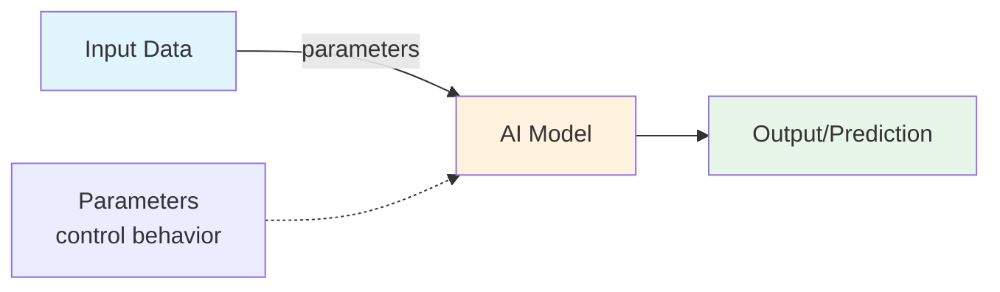

# Lesson 1: What is Physical AI?

Welcome to your first lesson! In this lesson, you'll learn the core concepts of Physical AI and run your first working example.

**Estimated Time**: 25 minutes

## Learning Objectives

By the end of this lesson, you'll understand:

- The basic structure of an AI pipeline (input → model → output)
- How parameters control AI system behavior
- How to run and modify AI examples
- The foundation for more complex AI concepts

## Concept Overview

Physical AI is about systems that perceive and act on their environment. At its core, every AI system follows a simple pipeline:

1. **Input**: Data from the environment (images, measurements, sensor data)
2. **Model**: A function or algorithm that processes the input
3. **Output**: A prediction or decision based on the model

Think of it like a simple machine: you give it something, it processes it, and returns a result. Parameters are the "knobs and dials" that control how the model processes inputs.

## Visual Explanation



## Example 1: Your First AI Program

Let's start with the simplest possible AI pipeline:

```javascript
// examples/chapter-1/lesson-1-example-1.js
// Basic AI Pipeline: Input → Model → Output

const input = 10;
const multiplier = 2; // This is a parameter

// The "model" - a simple transformation
const output = input * multiplier;

console.log(`Input: ${input}`);
console.log(`Multiplier (parameter): ${multiplier}`);
console.log(`Output: ${output}`);
```

**Try it out**:
```bash
node examples/chapter-1/lesson-1-example-1.js
```

Expected output:
```
Input: 10
Multiplier (parameter): 2
Output: 20
```

This shows the core AI pipeline. The multiplier is a **parameter** - it controls the behavior of the model.

## Example 2: Understanding Parameters

Now let's see how changing parameters changes the output:

```javascript
// examples/chapter-1/lesson-1-example-2.js
// Demonstrating parameter effects

function processInput(input, scale, offset) {
  // Model: Apply scaling and offset
  return (input * scale) + offset;
}

// Test with different parameters
const testInput = 5;

console.log(`Input: ${testInput}`);
console.log('');

console.log('Parameter Set 1: scale=2, offset=0');
const result1 = processInput(testInput, 2, 0);
console.log(`Output: ${result1}`);
console.log('');

console.log('Parameter Set 2: scale=3, offset=10');
const result2 = processInput(testInput, 3, 10);
console.log(`Output: ${result2}`);
console.log('');

console.log('The same input produces different outputs');
console.log('because we changed the parameters!');
```

**Try it**:
```bash
node examples/chapter-1/lesson-1-example-2.js
```

Notice: Same input (5), different outputs (10 vs 25) based on parameters.

## Example 3: Scaling Your Model

Let's build something slightly more complex - a model that handles multiple inputs:

```javascript
// examples/chapter-1/lesson-1-example-3.js
// Multi-input model

function aiModel(temperature, humidity, pressure) {
  // Simple model: weighted combination of inputs
  const weight1 = 0.5; // Parameter
  const weight2 = 0.3; // Parameter
  const weight3 = 0.2; // Parameter

  const prediction = (temperature * weight1) +
                     (humidity * weight2) +
                     (pressure * weight3);

  return prediction;
}

// Simulate sensor readings
const temp = 25;      // Temperature in Celsius
const humidity = 60;  // Humidity percentage
const pressure = 1013; // Pressure in hPa

const prediction = aiModel(temp, humidity, pressure);

console.log('Sensor Readings:');
console.log(`  Temperature: ${temp}°C`);
console.log(`  Humidity: ${humidity}%`);
console.log(`  Pressure: ${pressure} hPa`);
console.log('');
console.log(`AI Prediction: ${prediction.toFixed(2)}`);
console.log('');
console.log('The parameters (weights) control how much each');
console.log('input influences the final prediction.');
```

**Try it**:
```bash
node examples/chapter-1/lesson-1-example-3.js
```

This is a real AI pattern: multiple inputs combined with learned parameters to make predictions.

## Try This: Modify the Examples

Deepen your understanding by experimenting:

1. **Example 1**: Change the `multiplier` from 2 to 5. What happens to the output?

2. **Example 2**: Change `scale` to 10 or `offset` to -20. How do these parameters affect the output?

3. **Example 3**: Swap the weight values (e.g., weight1=0.2, weight2=0.5, weight3=0.3). Does the prediction change?

Try these modifications in your editor and run the examples again!

## Key Takeaways

✅ **AI Pipeline**: Input → Model (with parameters) → Output

✅ **Parameters** are the "knobs and dials" that control AI behavior

✅ **Same input** + **different parameters** = **different output**

✅ **Real AI** combines multiple inputs with parameters to make predictions

✅ All AI systems, no matter how complex, follow this basic pattern

## Check Your Understanding

**Question 1**: What are the three main components of an AI pipeline?
<details>
<summary>Show answer</summary>

Input, Model (with parameters), and Output. Data flows from input through the model to produce output.

</details>

**Question 2**: What happens when you change a parameter in an AI model?
<details>
<summary>Show answer</summary>

The model behaves differently - it transforms the same input into a different output. Parameters control the model's behavior.

</details>

**Question 3**: In Example 3, what do the "weights" represent?
<details>
<summary>Show answer</summary>

The weights are parameters that control how much each input (temperature, humidity, pressure) influences the final prediction. They determine the relative importance of each input.

</details>

---

**Great job!** You've learned the fundamentals. Ready for more? Move on to [Lesson 2: Core Concepts & Intuition](./lesson-2-core-concepts.md) 🚀
