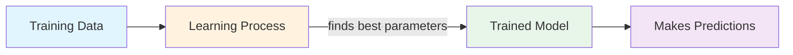

# Lesson 2: Core Concepts & Intuition

Build on Lesson 1! Now let's explore deeper AI concepts and develop your intuition.

**Estimated Time**: 30 minutes

## Learning Objectives

- Understand how AI learns from examples
- Explore intermediate AI patterns
- Develop intuition for model behavior
- Apply concepts from Lesson 1 to new scenarios

## Concept Overview

In Lesson 1, we had parameters we set manually. Real AI systems "learn" these parameters from data. This lesson explores how that learning happens at a conceptual level.

When an AI system "learns," it's really just finding the best parameter values to minimize error on a dataset.

## Visual Explanation



## Example 1: Building Intuition with More Data

```javascript
// examples/chapter-1/lesson-2-example-1.js
// Working with multiple data points

// Simulated training data
const trainingData = [
  { input: 1, output: 3 },
  { input: 2, output: 5 },
  { input: 3, output: 7 },
  { input: 4, output: 9 },
  { input: 5, output: 11 },
];

// Simple model: y = ax + b
// Can you figure out what 'a' and 'b' should be?

function predictWithModel(input, a, b) {
  return a * input + b;
}

// Let's test a guess
const a = 2;
const b = 1;

console.log('Testing model: output = 2*input + 1');
console.log('');
console.log('Data Point | Expected | Predicted | Error');
console.log('-----------|----------|-----------|-------');

let totalError = 0;
for (const data of trainingData) {
  const predicted = predictWithModel(data.input, a, b);
  const error = Math.abs(predicted - data.output);
  totalError += error;

  console.log(
    `input=${data.input}    | ${data.output}        | ${predicted}        | ${error}`
  );
}

console.log('-----------|----------|-----------|-------');
console.log(`Total Error: ${totalError}`);
console.log('');
console.log('A perfect model would have 0 total error!');
```

**Run it**:
```bash
node examples/chapter-1/lesson-2-example-1.js
```

## Example 2: Intermediate Patterns - Feature Engineering

```javascript
// examples/chapter-1/lesson-2-example-2.js
// Using multiple features to make better predictions

// Real-world scenario: predicting house prices
const properties = [
  { squareFeet: 1000, bedrooms: 2, price: 200000 },
  { squareFeet: 1500, bedrooms: 3, price: 300000 },
  { squareFeet: 2000, bedrooms: 4, price: 400000 },
  { squareFeet: 1200, bedrooms: 2, price: 240000 },
];

function predictPrice(sqft, bedrooms, w1, w2, bias) {
  // Weighted combination of features
  return (sqft * w1) + (bedrooms * w2) + bias;
}

// These parameters were "learned" from data
const w1 = 150;        // Price per sqft
const w2 = 50000;      // Price per bedroom
const bias = 50000;    // Base price

console.log('House Price Predictions');
console.log('');

for (const prop of properties) {
  const predicted = predictPrice(prop.squareFeet, prop.bedrooms, w1, w2, bias);
  const error = Math.abs(predicted - prop.price);

  console.log(`Sqft: ${prop.squareFeet}, Beds: ${prop.bedrooms}`);
  console.log(`  Actual Price: $${prop.price}`);
  console.log(`  Predicted Price: $${predicted}`);
  console.log(`  Error: $${error}`);
  console.log('');
}
```

**Run it**:
```bash
node examples/chapter-1/lesson-2-example-2.js
```

## Example 3: Applied Learning - Combining What We Know

```javascript
// examples/chapter-1/lesson-2-example-3.js
// Practical application: Decision making

function evaluateStudent(testScore, attendancePercent, projectQuality) {
  // Simple model for pass/fail decision
  const weight1 = 0.5;  // Test importance
  const weight2 = 0.2;  // Attendance importance
  const weight3 = 0.3;  // Project importance

  const score = (testScore * weight1) +
                (attendancePercent * weight2) +
                (projectQuality * weight3);

  return score;
}

const students = [
  { name: 'Alice', test: 85, attendance: 90, project: 90 },
  { name: 'Bob', test: 70, attendance: 80, project: 95 },
  { name: 'Charlie', test: 90, attendance: 60, project: 70 },
];

console.log('Student Evaluation System');
console.log('');

for (const student of students) {
  const score = evaluateStudent(student.test, student.attendance, student.project);
  const status = score >= 80 ? 'PASS' : 'NEEDS IMPROVEMENT';

  console.log(`${student.name}:`);
  console.log(`  Test: ${student.test}, Attendance: ${student.attendance}%, Project: ${student.project}`);
  console.log(`  Score: ${score.toFixed(1)} → ${status}`);
  console.log('');
}
```

**Run it**:
```bash
node examples/chapter-1/lesson-2-example-3.js
```

## Try This: Experiment More

1. **Example 1**: Try different values of `a` and `b`. Which values give the lowest total error?

2. **Example 2**: Adjust the weights (w1, w2). How does changing them affect predictions?

3. **Example 3**: Change the threshold from 80 to 75. How many students pass/fail now?

## Key Takeaways

✅ **Learning** means finding the best parameter values to fit data

✅ **Error** measures how far predictions are from actual values

✅ **Features** (multiple inputs) help make better predictions

✅ **Weights** control how much each feature influences the output

✅ Real AI systems learn these weights automatically from data

## Check Your Understanding

**Question 1**: What does it mean for an AI model to "learn"?
<details>
<summary>Show answer</summary>

Learning means finding the parameter values that make the model's predictions as close as possible to the actual data. The algorithm adjusts parameters to minimize error.

</details>

**Question 2**: In Example 2, why do we need multiple features?
<details>
<summary>Show answer</summary>

Multiple features provide more information. House price depends on more than just square footage - bedrooms, location, age, etc. all matter. More features usually allow better predictions.

</details>

**Question 3**: What would happen if all weights were equal?
<details>
<summary>Show answer</summary>

If all weights were equal, each feature would contribute equally to the prediction, regardless of its actual importance. In reality, some features matter more than others.

</details>

---

**Excellent progress!** Ready for the final lesson? Check out [Lesson 3: Building Your AI Intuition](./lesson-3-building-intuition.md) 🚀
