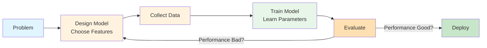

# Lesson 3: Building Your AI Intuition

Master the concepts! Apply everything you've learned to real-world scenarios.

**Estimated Time**: 35 minutes

## Learning Objectives

- Apply AI concepts to practical problems
- Develop deeper intuition about model behavior
- Understand AI limitations and considerations
- Think critically about AI system design

## Concept Overview

You now understand the core pipeline and how learning works. In this lesson, we explore how to think about AI problems, design models, and make decisions about parameters and architecture.

The key insight: **All complex AI systems are combinations of the basic building blocks you've already learned.**

## Visual Explanation



## Example 1: Practical Application - Real-World Prediction

```javascript
// examples/chapter-1/lesson-3-example-1.js
// Real scenario: Predicting customer spending

const customers = [
  { accountAge: 1, purchaseFrequency: 2, averageSpend: 50 },
  { accountAge: 3, purchaseFrequency: 15, averageSpend: 120 },
  { accountAge: 2, purchaseFrequency: 8, averageSpend: 85 },
  { accountAge: 5, purchaseFrequency: 20, averageSpend: 200 },
  { accountAge: 0.5, purchaseFrequency: 1, averageSpend: 25 },
];

function predictLifetimeValue(accountAge, frequency, avgSpend) {
  // Learned parameters
  const w1 = 100;     // Value per year of relationship
  const w2 = 15;      // Value per purchase frequency
  const w3 = 2;       // Multiplier on average spend
  const bias = 50;    // Base customer value

  return (accountAge * w1) + (frequency * w2) + (avgSpend * w3) + bias;
}

console.log('Customer Lifetime Value Prediction');
console.log('='.repeat(70));
console.log('');

for (let i = 0; i < customers.length; i++) {
  const c = customers[i];
  const ltv = predictLifetimeValue(c.accountAge, c.purchaseFrequency, c.averageSpend);

  console.log(`Customer ${i + 1}:`);
  console.log(`  Account Age: ${c.accountAge} years`);
  console.log(`  Purchase Frequency: ${c.purchaseFrequency} purchases`);
  console.log(`  Average Spend: $${c.averageSpend}`);
  console.log(`  Predicted Lifetime Value: $${ltv.toFixed(2)}`);
  console.log('');
}
```

**Run it**:
```bash
node examples/chapter-1/lesson-3-example-1.js
```

## Example 2: Advanced Pattern - Handling Edge Cases

```javascript
// examples/chapter-1/lesson-3-example-2.js
// Real AI systems must handle edge cases

function robustPrediction(input1, input2, input3) {
  // Real models need validation
  if (input1 < 0 || input2 < 0 || input3 < 0) {
    return 'ERROR: Inputs must be positive';
  }

  // Learned parameters
  const w1 = 2.5;
  const w2 = 1.8;
  const w3 = 0.9;

  const prediction = (input1 * w1) + (input2 * w2) + (input3 * w3);

  // Sanity check
  if (prediction > 1000) {
    console.warn('  ⚠️  Warning: Prediction unusually high (extrapolation risk)');
  }

  return prediction;
}

console.log('Robust Model with Validation');
console.log('');

const testCases = [
  { name: 'Normal Input', inputs: [10, 15, 20] },
  { name: 'Small Input', inputs: [1, 1, 1] },
  { name: 'Large Input', inputs: [100, 150, 200] },
  { name: 'Invalid Input', inputs: [10, -5, 20] },
];

for (const test of testCases) {
  console.log(`${test.name}: [${test.inputs.join(', ')}]`);
  const result = robustPrediction(...test.inputs);
  console.log(`  Result: ${result}`);
  console.log('');
}
```

**Run it**:
```bash
node examples/chapter-1/lesson-3-example-2.js
```

## Example 3: Experimentation - Playing with Models

```javascript
// examples/chapter-1/lesson-3-example-3.js
// Build intuition by experimenting with different models

function linearModel(x, slope, intercept) {
  return slope * x + intercept;
}

function quadraticModel(x, a, b, c) {
  return a * (x * x) + b * x + c;
}

function exponentialModel(x, base, scale) {
  return scale * Math.pow(base, x);
}

// Test data
const xValues = [1, 2, 3, 4, 5];

console.log('Comparing Different Model Types');
console.log('');

console.log('X Values:', xValues.join(', '));
console.log('');

console.log('Linear Model (y = 2x + 1):');
const linear = xValues.map(x => linearModel(x, 2, 1));
console.log('Y Values:', linear.map(y => y.toFixed(1)).join(', '));
console.log('');

console.log('Quadratic Model (y = x² - 2x + 1):');
const quadratic = xValues.map(x => quadraticModel(x, 1, -2, 1));
console.log('Y Values:', quadratic.map(y => y.toFixed(1)).join(', '));
console.log('');

console.log('Exponential Model (y = 1.5^x):');
const exponential = xValues.map(x => exponentialModel(x, 1.5, 1));
console.log('Y Values:', exponential.map(y => y.toFixed(1)).join(', '));
console.log('');

console.log('Notice: Different models produce very different patterns!');
console.log('Choosing the right model type is crucial for good predictions.');
```

**Run it**:
```bash
node examples/chapter-1/lesson-3-example-3.js
```

## Try This: Deep Experimentation

1. **Example 1**: Change the weights. How does each weight affect customer value?

2. **Example 2**: Add your own edge case test - what if all inputs are 0?

3. **Example 3**: Create your own model type. Try exponential with different base values.

## Key Takeaways

✅ **Real AI** combines basic building blocks: inputs, parameters, outputs

✅ **Model choice** matters - linear, quadratic, exponential give different patterns

✅ **Edge cases** and validation are critical in production systems

✅ **Parameters** must be chosen carefully through training and evaluation

✅ **Intuition** develops through experimentation and play

## Advanced Concepts to Explore

Once you've mastered these fundamentals:

- **Gradient Descent** - How parameters are automatically updated during learning
- **Loss Functions** - Formally measuring prediction error
- **Regularization** - Preventing models from overfitting to data
- **Feature Engineering** - Creating better input features
- **Model Evaluation** - Train/test splits, cross-validation

## Check Your Understanding

**Question 1**: Why is validation important in real AI systems?
<details>
<summary>Show answer</summary>

Validation catches problems: inputs outside expected ranges, unrealistic predictions, errors. Real systems must be robust and handle edge cases gracefully instead of crashing.

</details>

**Question 2**: When would you use a quadratic model instead of linear?
<details>
<summary>Show answer</summary>

Use quadratic when the relationship between input and output is curved, not straight. Linear only works for straight-line relationships. The right model type depends on the actual data pattern.

</details>

**Question 3**: How does changing one weight affect the whole model?
<details>
<summary>Show answer</summary>

Changing a weight changes how much that input influences the output. Larger weight = more influence. In complex models with many weights, small changes can have large effects on predictions.

</details>

---

## What's Next?

🎉 **Congratulations!** You've completed Chapter 1 and learned:

✅ The basic AI pipeline (input → model → output)
✅ How parameters control behavior
✅ How AI systems learn from data
✅ How to think about real-world AI problems

## Where to Go From Here

1. **Experiment more**: Modify the examples, try different parameters
2. **Read more**: Check out [Additional Resources](../reference/resources.md)
3. **Build something**: Use these concepts in your own projects
4. **Stay curious**: AI is rapidly evolving - keep learning!

---

**Thank you for learning with us!** Your journey into AI has just begun. Keep exploring, experimenting, and asking questions! 🚀
